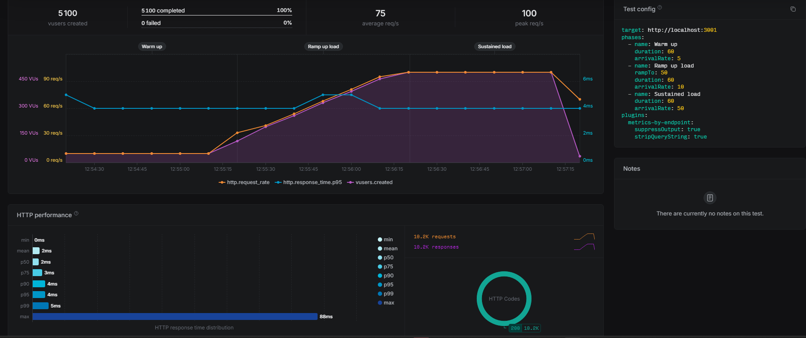
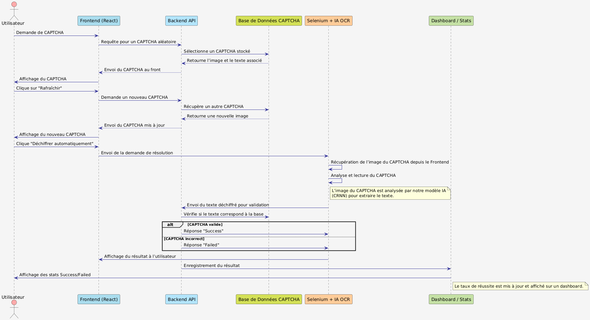
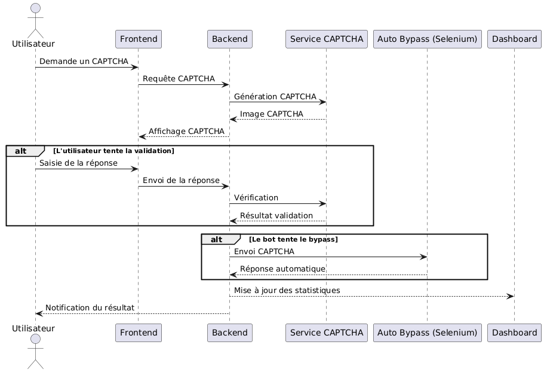

# 🔐 Projet de Contournement de CAPTCHA

## 🌟 Aperçu

Ce projet est une application conçue pour contourner le CAPTCHA v1 en utilisant un script Python utilisant un modèle IA et Selenium pour automatiser le processus de résolution de CAPTCHA.
Le projet inclut également une interface en React.js pour le frontend, Node.js/Express pour le backend, et une base de données MySQL.
Le frontend et l'API sont conteneurisés avec Docker, tandis que le script Python est hébergé localement à des fins de test.

## ✨ Fonctionnalités

- **Génération et Validation de CAPTCHA** : L'interface frontend génère des images CAPTCHA et permet aux utilisateurs de les valider manuellement.
- **Résolution Automatisée de CAPTCHA** : Un script Python utilisant Selenium et un modèle IA pour lire et valider automatiquement les CAPTCHA.
- **Tableau de Bord des Statistiques** : Un tableau de bord complet pour suivre les performances et les statistiques des tentatives de résolution de CAPTCHA.
- **Environnement Dockerisé** : Le frontend et l'API sont conteneurisés pour un déploiement et une mise à l'échelle faciles.

## 📂 Structure du Projet

```plaintext
captcha_solver/
│
├── api-captcha/
│   ├── Dockerfile
│   ├── init.sql
│   ├── ... (autres fichiers de l'API)
│
├── app-captcha/
│   ├── Dockerfile
│   ├── src/
│   │   ├── components/
│   │   │   ├── CaptchaComponent.js
│   │   │   ├── Stats.js
│   │   │   ├── ... (autres fichiers de composants)
│   │   ├── ... (autres fichiers frontend)
│
├── python-script/
│   ├── captcha_solver.py
│   ├── ... (autres fichiers Python)
│
├── docker-compose.yml
│
├── README.md
```

## 🛠️ Configuration et Installation

### Prérequis
- Docker et Docker Compose installés sur votre machine.
- Python 3.x installé pour exécuter le script de résolution de CAPTCHA.

### Étapes
#### Cloner le Dépôt :
```bash
git clone <https://github.com/Fantik94/captcha_resolver>
cd captcha_solver
```

#### Construire et Lancer les Conteneurs Docker :
```bash
docker-compose up --build
```

#### Exécuter serveur pour le script python :
```bash
cd Python/src
uvicorn main:app --host 0.0.0.0 --port 8000
```

---

## 🐳 Configuration Docker Compose
Le fichier `docker-compose.yml` définit les services pour la base de données **MySQL**, **phpMyAdmin**, l'**API**, et le **frontend**.

---

## 🌐 Composants Frontend

### CaptchaComponent
Le composant `CaptchaComponent` est responsable de la génération et de la validation des images CAPTCHA. Il inclut des boutons pour :
- Rafraîchir le CAPTCHA
- Valider l'entrée de l'utilisateur
- Exécuter le script Python pour automatiser le processus de résolution de CAPTCHA

### Composant Stats
Le composant `Stats` fournit un tableau de bord pour visualiser les statistiques des tentatives de résolution de CAPTCHA. Il inclut :
- Divers graphiques et tableaux pour afficher les métriques de performance

---

## 🐍 Script Python
Le script Python utilise **Selenium** pour automatiser le processus de résolution de CAPTCHA. Il :
- Lit l'image CAPTCHA
- Soumet la solution à l'API backend
- Utilise une API développée avec **FastAPI** pour permettre certains appels de routes, comme cliquer sur un bouton depuis le frontend et exécuter le script automatiquement

---

## 🏋️ Test de Charge

Un test de charge a été effectué pour mesurer les performances de l'application web.



[🔗 Voir le rapport détaillé du test de charge](https://app.artillery.io/share/sh_f9af46dabbb694d14cb2e97594368f74607ab1b492a0e7ea1c15b9d38de2312f)

---

## 🏗️ Architecture du projet






